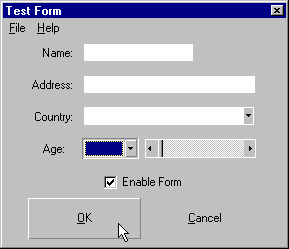



## Flat VBControls Extension

### Description

Do you wan't to make your controls really flat, like the ones in Office Toolbars (TextBoxes, CommandButtons, ComboBoxes, etc.)?

Then this is what you need!

Please, do Vote! By voting, you'll make the programmers efforts well spent!
 
### More Info
 
Remember to register the SSubTmr6.dll before running this program.

To register this file, open an MS-DOS box, go to your Windows System directory and write:

RegSvr32.exe <path>\SSubTmr6.dll

where <path> is the SSubTmr6.dll file directory.

             |
---                |---
**Submitted On**   |2000-04-16 16:18:22
**By**             |[Pedro Lamas](https://github.com/Planet-Source-Code/PSCIndex/blob/master/ByAuthor/pedro-lamas.md)
**Level**          |Advanced
**User Rating**    |4.4 (92 globes from 21 users)
**Compatibility**  |VB 5\.0, VB 6\.0
**Category**       |[Custom Controls/ Forms/  Menus](https://github.com/Planet-Source-Code/PSCIndex/blob/master/ByCategory/custom-controls-forms-menus__1-4.md)
**World**          |[Visual Basic](https://github.com/Planet-Source-Code/PSCIndex/blob/master/ByWorld/visual-basic.md)
**Archive File**   |[CODE\_UPLOAD48604162000\.zip](https://github.com/Planet-Source-Code/pedro-lamas-flat-vbcontrols-extension__1-7318/archive/master.zip)

